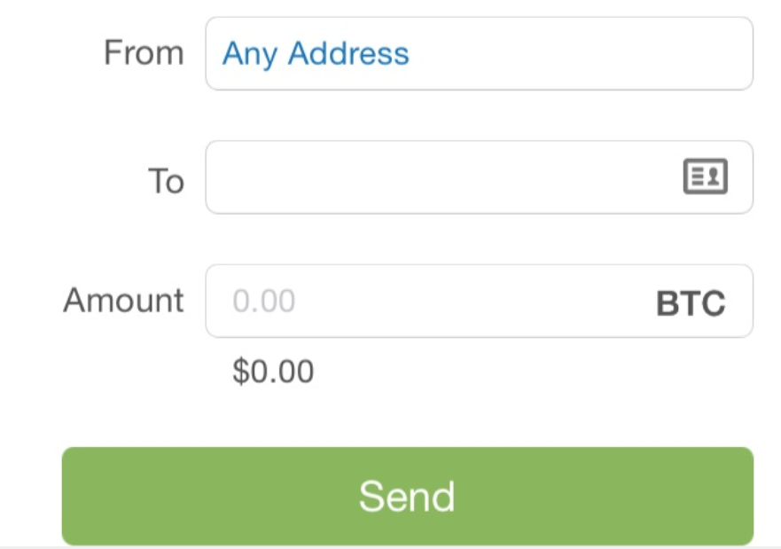
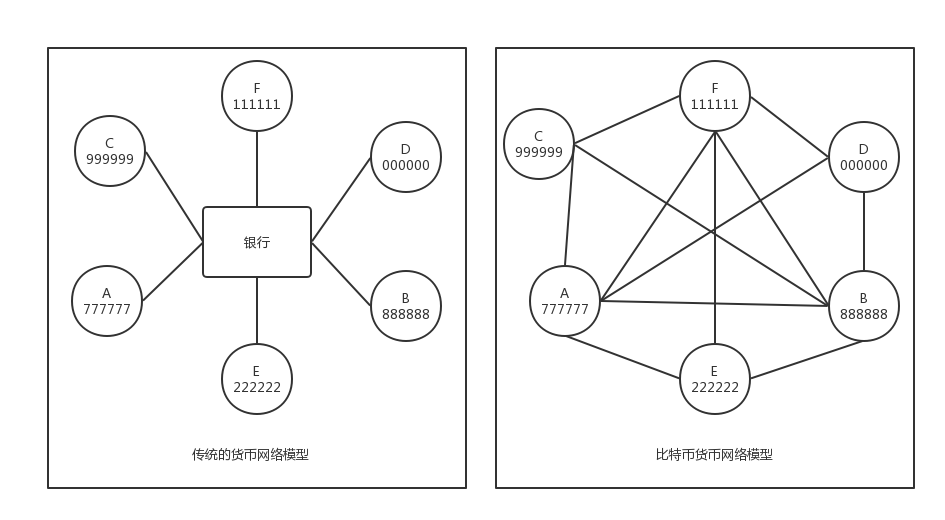
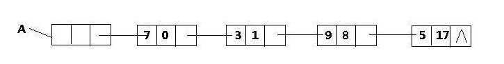

# Bitcoin核心概念
**简要说明：本文重点在对比特币的核心概念及关键过程的理解，标明出处的资源请注意版权，如要谋利，请和原出处沟通，未标明出处的资源，可放心使用。**

当前大热的区块链技术起源于一个叫Bitcoin的东西，区块链这个概念在Bitcoin出现前是不存在的，后来有些聪明人发现Bitcoin的底层技术有巨大的实际应用价值，开始思考把这个技术用到其它的地方以解决部分真实世界中的问题，因此，在我看来，要理解区块链，必须先理解Bitcoin。

文章目录：
* Bitcoin出现
* Bitcoin的交易，钱包，密钥，地址
* 比特币网络
* 区块链
* 共识机制
* 挖矿
* 不可篡改与不可删除的数据库

## Bitcoin出现
在我看来，电子货币可以分成两块：一块是当前我们日常生活中经常使用的各数电子货币：如支付宝，微信，信用卡，银行储蓄卡等，它只不过是现实世界里面的金钱的数字表现形式，另外一块电子货币我们称之为数字货币，对应于现实世界中的Bitcoin，LiteCoin，DogCoin等，当然，这些乱七八糟的各种数字货币本质上都起源于Bitcoin。

加密数字货币与数字货币本质上我认为都是一个东西，一个完全电子化的数字货币必须要用加密技术保证参与者交易的有效性及数字货币拥有者的唯一性，不然这个货币是没有办法得到大家认可的。

在计算机的世界里面，任何东西都是可以复制的。比如说，我们给朋友发送一个文件，其实发送的是一个文件的副本，并不是这个文件发送给朋友后，自己电脑上的文件就不见了，在许多场景下，这都没有任何问题，但是如果存储的一段二进制文件表示的是一种货币，那这个问题就很严重了，我买东西，发送给商家的东西是一个货币的副本，那世界还不全乱套了！

在Bitcoin出现前，已经有人提出了完整的数字货币概念原型，只是没有实现出来。**时间来到2008年，在世界金融危机的背景下，有一个叫中本聪的匿名人士发布了Bitcoin白皮书，在白皮书中首次提出了一种点对点的电子现金系统，从此，世界有了第一个完整意义上的数字货币，且这个货币体系完全由计算机节点控制，没有一个权威的中央发行机构，没有货币结算机构，因为货币的发行与结算功能已经集成到一个点对点网络里面去了！**

## Bitcoin系统的交易功能
 __从Bitcoin是一种货币的观点（现在可以说是事实了）开始。__ 我们知道，货币最本质的属性是交易中间物，所以Bitcoin作为一种货币必须要有交易功能。交易需要两个端点：一个发送方，一个接收方，在现实世界里面，这个交易端点抽象成账户的概念来表示。

想想现实世界里面的电子邮件系统，要使用网易163的电子邮箱收发邮件，那么必须要有邮箱的地址及密码，密码表示对此邮箱地址的控制权，而邮箱地址则表示发送和接收邮件的端点。此时可以用现实世界的邮箱地址及密码进行类比理解：Bitcoin里面的账户类似现实世界中的邮箱地址，Bitcoin里面的账户密码则类似现实世界中的邮箱密码，而邮件内容则类似于Bitcoin里面的货币，当然邮件内容视为货币有不小的问题，一个邮件内容可以转发给其它人，可以转发多次，那货币肯定是不行的，发送后的账户一定要减去对应的数目才行！

## Bitcoin地址，密钥及钱包
比特币里面标识一个账户名称的东西叫地址，地址是一串唯一的，安全的，满足某种规则的字符串，而对一个地址的控制权就叫做密钥，就像电子邮箱的密码表示了你对邮箱的控制权一样，千万不要把比特币地址对应的密钥给弄丢了，也不能把密钥给别人分享了。

为什么不要把密钥搞没了呢？是个很蹩脚的问题，但是估计只有丢了的人才知道有多疼吧！密钥没了，就没有任何办法能够找回来，不像现实世界里面，银行卡密钥忘记了还可以去银行重新设定密码，在Bitcoin的世界里面，要是密钥忘记了或者保存密钥的东西不见了，密钥对应地址里面的Bitcoin肯定没有办法继续使用！密钥保存的不好，被黑客或者其它人知道了密钥，那么知道密钥的人就可以知道你的账户地址，当然就可以把账户里面的Bitcoin转到他自己的地址里面。

### 地址与密钥的关系
由地址的产生过程可以更清楚地理解为什么私钥一定不能泄露或丢失，因为地址由密钥通过某种规则推导而来，所以，知道密钥，就可以推导出与此密钥对应的Bitcoin地址。反之，完全不用担心Bitcoin账户地址的公开性，因为从Bitcoin的地址出发，是没有办法推导出私钥的，这个数学算法有保证，尽管放心。

下面简单看一下比特币账户（地址及对应的密钥）的产生过程：
1. 通过某种方式得到一个密钥private-key（叫私钥也可以）
1. 通过椭圆曲线算法从私钥(private-key)计算得到公钥(public-key)
1. 对公钥（public-key）按先后顺序进行SHA256运算及RIPEMD160运算得到比特币地址（address)，公式表示形式：address = RIPEMD160(SHA256(public-key))
1. 对address进行Base58Check编码有加上版本前缀等信息得到可读性更好的Bitcoin地址

用Bitcoin进行交易，只有地址是公开的，而比特币地址没有和现实生活中的任何人身份信息进行一一绑定（不像银行账户开户号是与公民真实身份一一绑定的），任何人都可以按照比特币协议生成对应的合法地址，所以Bitcoin的交易是匿名的，这可以较好的保护隐私，但是也会带来监管的麻烦：非法交易通过Bitcoin支付结算就比较难追踪。

### Bitcoin钱包
Bitcoin钱包一点儿也不麻烦，就是一个用来管理一堆密钥对的工具，里面有成对的Bitcoin地址及对应的私钥，当然还有发起交易及交易签名的功能。

## 交易
假定已经有一个Bitcoin地址，里面有一定的Bitcoin余额，那如何向其它人转账呢？怎么保证转账过程是安全的呢？

比特币是数字货币，没有实体纸币，那怎么说一个地址里面有多少Bitcoin余额呢？在区块链数据库上去查询一个Bitcoin地址，此地址显示的Bitcoin余额的数量就表示拥有Bitcoin的数量，和银行账户里面的余额是差不多的概念。

怎么向其它人转账呢？这个也简单，通过下面的钱包软件截图，输入接收方的Bitcoin地址，再输入要转给对方的Bitcoin数目，仔细核对无误后，再点击一下发送就可以了，像下面的图一样（图片来自<<精通比特币>>一书截图）：

当然，钱包里面的发送地址可选可不选，不管选还是不选，下面这个要求一定是要满足的：钱包里面所有地址的Bitcoin总数要大于或者等于要转出的数目才行！

### 数字签名的在交易中的应用
上面的交易发出有一个问题：比特币是完全电子化的，没有银行实体机构，没有发行实体，之前的交易验证与结算是通过银行来完成的，现在没有了这些，要如何来进行交易验证与结算？

交易验证与结算由整个比特币网络的共同努力来完成，这个后面再说，现在先说一下数字签名在Bitcoin交易中的应用：**交易发送者在交易信息的尾部附加上发送者的交易签名信息，一起发送给Bitcoin网络。具体来看：发送方用钱包里面对应的私钥进行数字签名，比特币网络中的节点通过交易中出现的地址作为公钥进行解密及进行HASH运算，进而验证交易的有效性，只有通过一定规则验证的交易信息才认为是有效的，才会由相邻节点继续转发与组装进区块，进而在合适的时机写入区块链数据库。**

## 比特币网络
比特币是一种点对点的电子现金系统，这儿的点对点要理解为peer-to-peer，不是point-to-point，peer-to-peer表示的是通讯的两个节点在地位上是对等的，对等则理解为你有的权利我也有！

先看看下面一张图：

传统的货币网络模型是中心化的模型，我们的账户都是在银行开的户头，给他人转账是通过银行的交易验证与结算功能来实现的，银行看看我们的余额够不够转账，如果余额足够，则从我们的户头里面减去一笔钱，然后再另外一个户头里面增加相等数量的钱，当然有时候跨银行转账还需要收取一定的手续费，**其本质上是通过一个可信任的第三方来进行交易的验证与结算。**

而比特币网络里面没有任何中介信任机构，只有由运行软件的节点组成的计算机网络，如上图右侧所示，而且这个网络中的各节点地位理论上来说是平等的，那么交易的验证与结算是由谁来执行呢？

答案是所有节点，核心流程是下面这个样子的，假设右图中D发起一笔交易，那么这个交易信息会发送给与D连接的网络节点A,B,F，这三个节点收到相关交易信息后，进行下面的验证交易有效性操作：
* 查看交易信息是不是由A发出的（数字签名技术）
* 查看各交易地址下面的余额是否有足够的Bitcoin数量
* 验证接收方的地址是否存在与有效
* 其它相关规则验证

上面的交易验证过程通过后，各节点才认为这个交易信息是有效的，才会进一步把交易信息组装进候选区块，还会把交易信息继续转发给与自己连接的其它结点，其它节点也进行独立的交易验证过程，这样几个回合把交易信息在网络中传播后，在较短的时间内一笔交易信息就可以到达绝大部分网络节点。

再加上10分钟左右一波的交易结算，在满足其它一些条件后，这条交易信息会记录进真实的区块链数据库中，成为永久记录的一部分。

根据节点提供的功能集合不同，可以再进一步细分，因为我的理解目标是突出Bitcoin的主线，所以不再列出对节点的分类，只讨论核心客户端，也就是包括钱包，路由，挖矿，区块链数据库功能集合的全节点。

钱包主要用来发起交易，控制账户，查看余额等功能，路由功能简单来说就是比特币网络中的节点如何保持连结，交易信息如何在全网中进行验证与传播，挖矿则是为了生成下一个有效的区块，区块链数据库则是记录全网所有交易信息的全局大账本。

## 区块链
**区块是一种预定义的数据块，这个数据块里面除含有交易信息外，还有生成这个数据结构的时间戳，及前一个区块的哈希值（数字指纹）及其它有用字段。一系列区块经过哈希值连结起来的链条称之为区块链，形成一个持久增长的，不可篡改的，公开透明的数据库。**

上图是一个简单链表，A表示的是头指针，每一个数据块都有一个指针指向前面一个数据块的地址。同样可以把上面的图简化理解为一个区块链，连线关系由指向前一个数据块的地址换成指向前一个区块的HASH值就可以了。

比特币网络所有节点都有一个全部交易历史的数据库，也就是上面的区块链数据结构在所有诚实结点上都有一份一样的数据副本，任何节点都独立验证交易，转发交易，检验新区块的有效性，把合法新区块写进自己的数据记录副本，只有控制全网51%的节点才有可能控制整个比特币网络，据说，现实生活中不可能。

**因为所有参与系统的完整结点地位对等，各有一个全网交易记录的数据记录副本，而且数据记录是公开的，所以，可以将区块链视为一个全局透明的公开总账本，所有节点都认为这个总账本是权威的可信的记录。**

## 共识机制
所有节点都要记录交易信息，而交易信息的集合是通过数据块的方式（区块）一个一个按照时间顺序追加进区块链的，那么这些节点是如何将新的区块追加进区块链的呢？并且这些节点以什么样的规则来确保各节点的区块链数据是一致性且正确性呢？换句话说：比特币这个去中心化网络如何就新区块的达成共识，以维护全网数据的一致性与正确性？

比特币网络的的去中心化共识通过各节点独立执行下面的4种过程相互作用而产生：
1. 每个全节点依据某标准独立对交易进行验证
1. 通过完成工作量证明算法，挖矿节点将交易记录独立打包进新区块
1. 每个节点独立的对新区块进行校验并组装进区块链
1. 每个节点对区块链进行独立选择， 在工作量证明机制下选择累计工作量最大的区块链

过程1是交易验证过程，在上面已经描述过了，主要是用来验证交易者发出的交易是否是真实的。

**过程2是生成新区块的过程，在比特币的世界里，这个过程叫挖矿，专门专注于挖矿功能的节点称为矿工，哎，取的名字真是太多了，大白话理解，只要可以运行挖矿功能（运行SHA256算法以生成新区块）的节点都可以叫做挖矿节点。**

在生成新区块的过程中，节点会先收集之前网络中的交易信息，并将收集到的交易信息按照一定规则组装成候选区块，在满足新区块的规则后，开始运行挖矿算法（SHA256算法），直到找到满足条件的HASH值为止，找到目标值后，把新区块追加到区块链，然后向周围的连结结点转发新区块供其它节点验证。

收到新区块的节点先对区块进行检验，验证来自其它节点的新区块是否有效。**SHA256算法有个很好的特点是，要挖出新区块真的是只有进行不断的尝试，而要验证数据是否有效，则只需要一次检验就可以了。** 如果新区块验证有效，那么就转发区块给其它近邻节点且把新区块追加进进自己的区块链中，当然还有一些其它的小动作，如将自己的候选区块与新区块比对，从候选区块中删除新区块中已经存在的交易数据，重新组装新的候选区块等。

每个节点独立对新区块的位置进行选择，选择累计工作量最大的链条，一般也是最长的链条，这儿对此不再继续展开，只简要说明一下：因为是分布式网络，就一定会有网络延时，如果出现两个节点几乎同时生成了有效的区块，就会在一个区块后面出现两个新的区块，这时就出现了分叉现象，但是因为机制规定选择最大工作量的链条，所以在交易继续进行，区块链长度继续增长的情况下，最终所有节点会选择在一条最长的链条后面追加数据，也就是区块链网络达成的是最终一致性，而不是强一致性。

**强数据一致性是指在任何时候新加入区块链的区块都是一致的，不允许有偏差与错误，典型的网络是Ripple网络（后面有机会再说说这个支付网络），弱一致性指的是并不要求任何时候区块链的数据都是一致的，但是最终的会有一个结果（或者某一长度时间内的结果）是全网一致的。**

## 挖矿
上面是比特币网络的共识过程，这个网络维护的区块链账本最终会有一个全局一致的结果，在共识过程中，这里面用到了许多技术：非对称加密技术，HASH算法，数字签名技术，分布式共识技术等。**在我当前的理解来看，比特币的精华却在两个部分：一个是挖矿算法的设计，另外一个区块链的结构设计。**

挖矿有下面的主要核心功能：
* 将交易结算功能由传统的中心化模型变成去中心化模型
* 挖矿过程同时还是比特币的发行过程，而这同时也是一种激励机制

**传统的的交易结算模型由银行完成，是中心化的，比特币的重大革新之处是将货币的结算过程去中心化，由上述的分布式网络共识机制来完成，同时通过竞争记账权的方式，有效地防止了数字货币的双花问题（同一笔钱花出去两次），而这样的系统随机选择记账结点的方式有效地避免了单节点攻击问题，不会像传统银行一样在安全系统上投入巨量的资源来维护整个交易系统的安全。**

这种去中心化的交易验证与结算过程竟然创造了一种新的信任模型：**在不可信任的节点间建立了一个最终大部分节点都认可的，不可删除的，不可篡改的，公开的数据记录，这或许就是比特币带来的最有革命性的理念之一。**

挖矿过程同时还是比特币的发行过程，在矿工生成打包候选区块的时候，矿工会将区块中的第一笔交易记录为coinbase交易，这个coinbase交易是作为奖励给矿工投入运算的辛苦费，奖励的Bitcoin的数量按照一定的曲线减少，总计是2100万颗。

矿工还有一笔收入是交易手续费用，当然在比特币的2100万颗发行完毕后，吸引矿工就只有比特币的交易手续费用了，当前最主要的激励因素还是来自Bitcoin网络的发币激励！

**简单的挖矿逻辑理解就是：矿工挖矿的的目的是为了生成新区块，抢夺系统的记账权，为啥人家愿意投入成本来搞这个事情？因为有比特币赚嘛！在当下的社会里，比特币就钱，而且比好多货币都值钱。**

由分布式挖矿的区块生成设计再加上区块链的结构设计，最终产生了一个不可篡改的交易日志全记录数据库，中本聪确实厉害！

## 不可篡改和不可删除的数据库
我经常听说，区块链是一个不可篡改，不可删除的数据库。为什么说这个数据库不可修改呢？因为联结区块的结构是前一个区块的哈希值，只要有一个区块的数据被修改，则其后所有的区块都要重新进行工作量证明算法的计算，这个计算量在当前来说是非常庞大的了，简直就是相当困难。再加上就算单个节点有这样的能力与雄心，但是其它的节点不认你的结算结果，因为你的结果和我的不一样，你小子是不是在做坏事儿？不理你！这样矿工就是白白浪费巨大的算力而没有收收益，变得没有利益可图，当然如果是一群节点来搞这个事情，一群不诚实节点控制的力量达到系统算力的51%时，比特币网络就危险了，听说当前不太现实，暂时先不追究。

由上面的理解来看，说不可修改不是真的不可修改，而是要完成全网共识的修改是真的真的很难的一件事情，当难到几乎没有办法实施时，现实世界中一般认为比特币区块链的数据记录是不可篡改的。不可删除更好理解了，所有节点都有一份完整的区块链记录，要使所有节点都离开比特币网络简直就是不可能的事情，因为社会上已经投入了非常多的资源到这个地方而且越来越多的人相信这个东西，怎么可能说走就走呢？又不是几千块钱的事儿，可是上百亿美金的市场和人们的信仰在里面呐！
