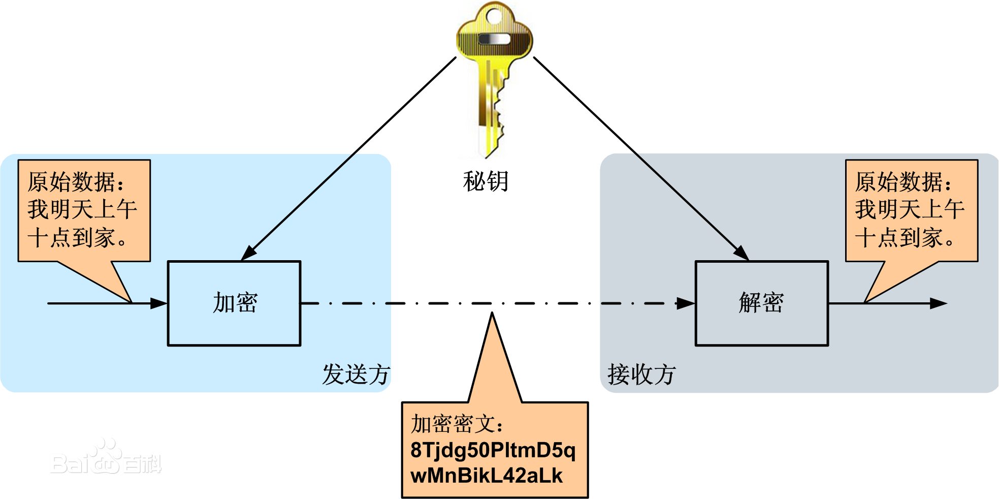
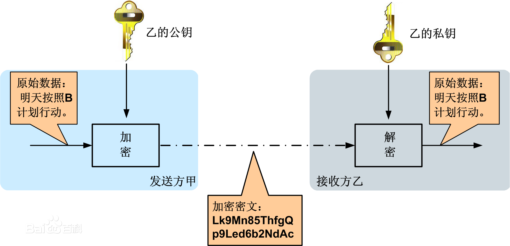
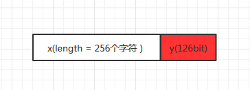

# 比特币背景知识之密码技术
在读《精通比特币》的时候，整个过程有点小痛苦，因为里面有很多地方用到了加密技术，用到信息加密技术的地方有：
1. 钱包安全问题（发送交易，私钥安全）
1. POW工作量证明算法
1. 把区块连接到一起的SHA256算法
1. 区块头数据里面的Merkle根

总结起来，比特币里面用到的密码学知识有两块：一块是非对称加密体系，一块是HASH算法。本文从密码学的发展简史引出非对称加密算法，然后说明摘要算法，最后给出一个非常好的数字签名文档，整体内容结构如下：
1. 密码学发展简史
   1. 算法保密阶段
   1. 对称加密阶段
   1. 非对称加密阶段
1. 数字摘要算法
1. 数字签名

# 1. 密码学发展简史
加密技术的发展经历了三个阶段，分别是算法保密阶段，对称加密阶段及非对称加密阶段。

## 1.1 算法保密阶段
加密技术自古有之，在早期阶段，**保密的核心在于对加密算法的保密。**我用一个故事来表述对此时期的加密处理过程。

假定：我是一个唐朝的皇帝，我最相信的的一个好兄弟任西北边疆的守土将军，我和将军之间的通讯通过士兵来完成，因为当时技术实在太落后。

我和将军之间有约定，按照一种规则来对敏感的军事信息进行加密处理后再传递，如将军想发出军事信息：“西北有战事，需紧急调兵”，在发送前，将军先把上面的信息转化成字符串“1234506789a”，再让士兵送给我，我收到信息后，按照之前的约定反向解密还原成原始信息。

当然，这个阶段的加密规则是可逆的，也就是根据“1234506789a”可以反向求解出“西北有战事，需紧急调兵”，用一个最简单的模型来类比：y = 3x + 5，x = (y - 5) / 3，由x到y是加密，由y到x是解密。只要加解密方法不泄露，传输通道就是安全的。

## 1.2 对称加密阶段
后来技术发展了，我觉得加密算法保密不靠谱，经常有人把我们的加密方法泄露出去了，不得不经常改，后来有大臣提出意见：要不搞个像家门钥匙一样的东西，有个钥匙就行了，我才不想管这个锁是怎么运行的呢！也就是说，就算加密方法你知道，但是没有密钥，照样你解不了！用下面的图示更直白：

在这个加密体系里面，因为加密与解密都用的是同一个密钥，所以一般术语上说对称加密算法，对称加密技术的安全性取决于两件事情：
   1. 加密算法本身的安全程度
   1. 密钥的安全保护问题

加密算法已经有非常成熟的算法，计算机业内有很多标准算法，如	DES，3DES，TDEA，Blowfish，RC2，RC4，RC5，IDEA，SKIPJACK，AES等，根据不同的应用场景来选择不同的加密算法。

**对称加密算法的优点是算法公开、计算量小、加密速度快、加密效率高。**

**密钥管理是最麻烦的事情，因为传输信息的两方一般相距遥远，这个信息在传输过程中出问题的可能性较大。**

## 1.3 非对称加密阶段
后来我发现共享密钥真的是一个很麻烦的事情，经常在给别人通知密钥的过程中出问题，而且一旦某个兄弟叛变了， 这个加密信息通道有时候可能会要了我的命！于是我让大臣们继续想办法解决这个问题，后来有聪明人提出了非对称加密算法。

对称加密算法在加密和解密时使用的是同一个秘钥；而非对称加密算法需要一对密钥来进行加密和解密，这一对秘钥由一个公开密钥（public key，简称公钥）和一个私有密钥（private key，简称私钥）组成，工作过程如下：

假定密钥对由 publickey 和 privatekey 组成，它们有下面的性质：
  * publickey由privatekey组成，但是privatekey不能经过publickey反向推导出来
  * 信息经过publickey加密后，只能由privatekey解密
  * 信息经过privatekey加密后，只能由publickey解密

这样，信息发送者只需要保管好自己的私钥就可以了，公钥完全公开出去，便于对方加密及解密。已经有成熟的非对称加密算法体系：如RSA，ECC等。

**注意：	非对称加密的缺点是加密和解密花费时间长、速度慢，只适合对少量数据进行加密**

# 2. 数字摘要算法
这样的算法，目前我们称它为HASH算法，也称之为信息摘要，数据摘要算法等：
输入：任意一段长度的数据  ----》》》 算法处理 ----》》》 输出：固定长度的一串数据，数学模型：y = f(x)，对算法f有下面的特性要求：
 * 对于同一个数据x，算法处理的结果y是一样的
 * 对于输入数据中的很小变化(如有两个输入数据x1和x2，且差异非常小)，算法输出的结果却会发生非常大的变化（y1与y2的差别非常大）
 * 不同的数据，算法处理的结果不一样（从概率论的角度来说，就是概率非常非常小，比如小到0.000000000001%)
 * 不能通过输出再还原回去输入数据了，也就是有不可逆的性质
一般这样的映射关系用HASH来代替f，就是y = HASH(x)

输入数据的长度有没有限制呢？输出数据的固定长度到底是多长呢？这个要看情况，输入一般没有长度限制，输出一般有长度限制，不同的HASH算法有不同的固定输出长度，HASH算法一般不用自已实现，有开源的库，HASH算法根据输出数据的固定的长度可以再进一步细分为MD5，SHA-224,SHA256等。

一般地，把输出的y称之为这个数据的“指纹”，另一个说法是数据摘要，HASH算法处理后的结果可以唯一地标识原始信息，不那么恰当的类比一下：输入信息当作一个真实世界的人，而指纹信息可以唯一地标识一个人。

**注意：这个算法有好多名字：散列算法，哈希算法，数字指纹，数字摘要，本质上都是上面体系里面的东西，散列算法和哈希算法重点在于对算法的描述，数字指纹和数字摘要重点对算法结果的描述，区分清晰就可以了。**

__那么这个的用途呢？在信息加密领域，主要用来检测发送前后数据有没有被修改__, 假定如下面的图示：

发送方A：发送的数据为x，摘要算法后的结果为y，摘要长度126位，把摘要数据附在原始数据x的后面一起发送给B
接收方B：接收到数据后，取出数据的最后126位当作数字指纹y，对去除后面126位数据得到的x用相同的摘要算法处理得到y1，如果y1 != y，则B认为数据在传递过程中被修改了，数据有问题，只有在y1 == y的时候，才认为数据是可靠的。

# 3. 数字签名
有一个文档写的非常不错，讲的非常清楚，用到了上面的非对称加密算法及哈希算法，文档链接如下：http://www.ruanyifeng.com/blog/2011/08/what_is_a_digital_signature.html
