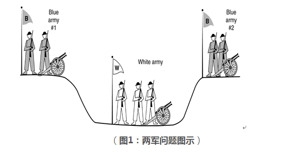

# 区块链系统常用共识算法
之前在[Bitcoin之共识算法](Consensus-algorithm.md)里面提到，分布式系统的核心问题是：**如何在异步通讯系统中节点达成对数据状态的共识，解决方案是提出对应问题的共识机制，核心是共识算法的设计。**

本文主要内容包括下面两个方面的主体内容：**拜占庭将军问题的本质及常用共识算法的简单列举，如果没有理解拜占庭将军问题的实质，我认为很多共识算法是看不清楚其应用场景的，所以，我们先再看看拜占庭将军问题。**

## 1. 拜占庭将军问题
下面的故事是我对拜占庭将军的一个简要表述：

拜占庭帝国准备攻打A国，派出了10支军队对A国进行了合围，A国的极限防御水平是能够同时抵抗5支军队的攻击，由于地理原因，每支军队的驻扎在A国边界不同的方位，军队不能将所有军队力量聚集在一起用单点突破的方式搞定A国，10支军队的将军之间的通讯只能通过信使完成，困扰将军的问题的是，他们不能确定他们中是否有叛徒，叛徒可能变更进攻意向或者变更进攻时间，在这种情形下，这些将军能否找到一种分布式协议能够远程协商，对进攻（至少6支军队要同时进攻）或者放弃进攻达成一致的共识？

我们需要注意到，__这儿有一个隐含的假设，即信使在传递信息的过程中不存在信息丢失或消息篡改等问题，也就是说，通讯通道安全可靠，没有问题。__ Lamport已经证明了在消息可能丢失的不可靠信道上试图通过消息传递的方式达到一致性是不可能的，因此在研究拜占庭将军问题时，是在通讯信道可靠的前提下，去做一致性与正确性的研究。

### 1.1 两军问题
一定要区分清楚拜占庭将军问题与两军问题，否则会引起很多疑惑，那么来一起看看两军问题吧：

如上图所示，有两支军队，位于沟渠里面的白军及位于沟渠两边的蓝军，两侧蓝军必须同时发起攻击才能消灭白军，他们不能远程沟通，只能派遣信使通过沟渠沟通双方同时攻击时间。在这儿，是否存在一个稳定可靠的使蓝军必胜的协议，就称为两军问题。

**仔细和上面的拜占庭将军问题对比，你会发现信使可能在经过沟渠的道路上被抓捕，消息可能丢失，也就是对蓝军来说，这条通讯信道是不可靠的，但是并没有叛徒的说法，也就是说两军问题的本质上是在研究通讯信道不可靠的问题。**

### 1.2 拜占庭将军问题本质
总结一下，拜占庭将军问题与两军问题不是同一个问题，两者是有本质区别的。__拜占庭将军问题的基本假设是通讯信道安全可靠，且分布式网络中可能存在作弊节点的情况下，系统整体如何达成一致性的共识，而两军问题研究的是在不可靠的通讯信道环境中，可靠的通讯双方如何就某一提案达成一致性的决议。__

继续拜占庭将军问题讨论，一群将军需要就攻打A国时间需要达成一致，但是这群将军里面可能有叛徒，影响一致行动的达成，因些，拜占庭将军首先是一个一致性问题，需要注意的是将军里面的叛徒只能占少数，如果叛徒将军占多数了，那就是将军集体谋反的问题了。

只要最终共识是一致的就可以了么？答案是不行的，假想因为条件不利，不适合攻打A国，但是共识的结果却是将军们集体攻打了A国，或者条件有利，适合进攻A国，但是共识的结果却是不攻打A国，因此，光对共识结果的“一致性”要求是不够的，还需要有一个”正确性“的要求。

这就是分布式共识机制中“一致性”与“正确性”要求的由来，当然在实际工程领域中，还需要加上一个“可用性”的要求，举个最简单的工程上的例子，假设我们现在的微信支付功能，在线下转账的过程中，如果需要买卖双方等10分钟才会有交易确认的回执，那真的是很难在实际环境小额环境中应用起来的，要是我的话，我肯定带上现金，付完钱立马走人。

最后用计算机术语翻译下拜占庭将军问题：__在拥有可靠的传输通道的前提下，同时在可能有少数作弊节点的分布式系统环境下，系统如何就系统的状态达成一致而正确的共识__。对拜占庭将军问题的求解我们称为拜占庭容错协议（Byzantine Fault Tolerant），其协议抽象称为称为拜占庭容错算法（BFT算法）。

## 2. 常用共识算法
在区块链网络中，根据应用场景的不同，会选择不同的共识算法，在私有链和联盟链的网络中， 一般对一致性与正确性有很高的要求，通常用强一致性算法，而在公有链的情况下，一般无法做到在任何时候区块链的数据都是一致的，通常用最终一致性算法。

强一致性算法是指分布式系统的状态在任何时刻都是一致的，而最终一致性算法（或者叫弱一致性算法）容许系统的状态在阶段性的不一致，但是最终是要一致的。

我并不打算重复从网络上COPY一份完整的算法过程，只给出对应算法详细介绍的链接和说明我所理解的算法背后的主要思想。

### 2.1 PBFT算法
Practical Byzantine Fault Tolerant（PBFT）是一个广泛应用的BFT算法。因为理论上的BFT系统要求完整性与绝对正确性，但是实用性就不好了，而在实际环境下则需要为了获取可用性而放松一些理论条件的限制，PBFT算法则是工程应用领域的实践，此算法大大降低了理论上BFT系统的复杂性，使实践成为可能。

[这个中文链接介绍的还不错！](http://blog.csdn.net/BlueCloudMatrix/article/details/51898105)

### 2.2 Raft算法
在私有链及联盟链的场景中，一般对共识算法有强一致性要求，共识效率要求较高，且一般不会存在恶意节点的情况，可以考虑非拜占庭协议的分布式共识算法，这样的算法有Paxos算法，Raft算法， 这两种算法针对的是分布式的系统中存在故障，但不存在恶意节点场景（即可能消息丢失或重复，但无错误消息）下的共识达成问题；因Paxos算法非常复杂且难于理解，实际中有各种各样的简化实现，Raft算法就是Paxos算法的一种简化实现。

[这个链接很不错，竟然有交互展示!](http://www.jdon.com/artichect/raft.html)

### 2.3 POW算法
此算法跟随Bitcoin的火热变得闻名天下，要弄清楚Bitcoin的共识机制，是需要弄清楚这个算法的，不难，说实话，是我见过共识算法里面最简单的了。

[请跟随Bitcoin一起理解！](http://zhibimo.com/read/wang-miao/mastering-bitcoin/Chapter08.html)

### 2.4 POS算法
社会对POW算法的能源消耗争议较大，我觉得吧，要想有一个世界货币，还不得支出相应的成本？哪儿有这样的好事情，只要事情的目标够远大，解决的问题足够好，带来的价值足够大，拿出较高的成本也是可以接受的嘛！针对耗费的能源问题，有人提出了工作量证明的替代算法，POS就是其中的一种方法。

POS算法首次提出是在2013年，点点币里面实现了些算法，思想非常类似于实际生活中的公司的股东，一般情况下，股东的权益所由持有的股份数量决定，股份持有数量高的个体有更多的对公司的投票权，POS算法也类似，持有币的数量相当于持股比例，有更大的可能性获得系统的记账权，因此有较大可能获得记账的收益和交易的手续费用，恶意参与者则会受到对应的处罚。

[来自维基百科！](https://en.wikipedia.org/wiki/Proof-of-stake)

### 2.5 DPOS算法
POW算法有能源浪费的不足和挖矿中心化的风险，而POS算法有可能出现记账权越来越向部分少数者聚集，造成富者越富的趋势，Delegated Proof of Stake（DPOS）算法的出现正是应对上面机制的“缺陷”。

DPOS算法引入一个民主中间层来记账，我认为相当于现实生活中股份公司的管理层，全体股东以一人一票的方式投票选择一个民主的管理层来记账，同时对管理层的权利进行了一定的限制，进而降低系统记账权中心化的风险，首次出现是在比特股（Bitshare）中。

[点此了解DPOS算法的细节！](https://bitshares.org/technology/delegated-proof-of-stake-consensus/)

## 3. 共识算法如何选择？
引用网络上的一段文字吧，个人认为说的在理：

**一言以蔽之，共识最好的设计是模块化,例如Notary，共识算法的选择与应用场景高度相关，可信环境使用paxos 或者raft，带许可的联盟可使用pbft ，非许可链可以是pow，pos，ripple共识等，根据对手方信任度分级，自由选择共识机制，这样才是真的最优。**
