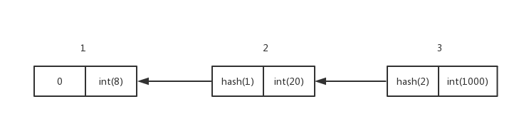
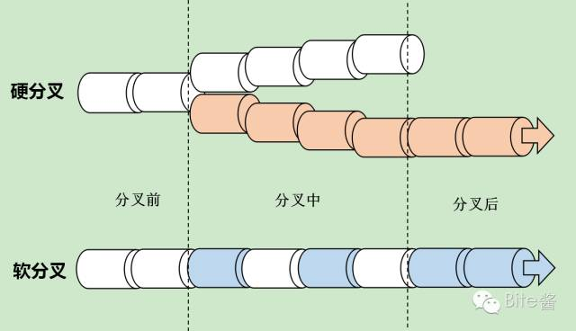

# 分叉-硬分叉-软分叉
经常听到分叉两个字，在读《精通比特币》时，里面就有比特币分叉，后来又出现了比特币硬分叉为BCH，以太坊硬分叉为ETH，怎么样也得知道分叉到底是个什么意思吧，本文是我对上面三个概念的理解。

## 分叉
在所有节点运行版本一致的前提下，节点拥有的区块链主链数据临时出现不一致的情况。这个理解源之《精通比特币》一书，有兴趣的读者可参考此书8-10章节，里面有非常详细的解释。

## 软分叉 VS 硬分叉
**先说说一个基本结论：不管是软分叉还是硬分叉，核心都在于对区块数据结构的更改，更改可以是区块中字段含义，字段范围的修改，也可以是区块数据结构字段增加，删除，甚至重定义区块结构等。**

**区块链是一个不可篡改的数据库，由区块按照时间顺序由HASH值联结而成，前后相连的HASH关系没有谁会想着去修改，但是把区块的结构，或者区块的字段含义修改了，区块就修改了，最终当然是区块链修改了。**

### 软分叉
在上面的理解下，我们再来看软分叉，**软分叉是指运行两个不同版本的节点对区块数据结构的解释变得不一样了，核心在于旧版本节点对新版本节点挖出的区块是可以接受的，而新版本节点对旧版本结点挖出的区块不一定可以接受。**

我们用下面的图片先理解一下：

我模拟定义了一个简单到极致的区块链数据结构，假设是V1.0版本，区块里面只有两个字段：
> - 一个用来表示区块联结关系的hash字段
> - 一个用来表示区块数据的字段，存储整形数据，数字范围:0-0x3FFFFFFF

这个非常简单的区块链发展一段时间后，我们发现，V1.0版本产生的数据字段有缺陷，只应该产生1000以内的整数值，所以发布了V1.1修正上述问题，严格限定数字字段的值在0-1000以内，且对来自其它节点的区块数据进行合法性校验。

升级到版本V1.1的节点产生的区块传递到V1.0版本的节点会被认为是合法的，会追加进区块链当中，但是V1.0版本产生的区块这个时候就有点麻烦，会有下面的情形出现：
* 如果数据字段的值在0-1000范围内，那么V1.1版本结点是可以接受并放入区块的。
* 如果数据字段的值不在0-1000范围内，那么V1.1版本结点是不会接受V1.0版本产生的区块。

__软分叉软件升级最终还是只会有一条链，用软件术语来说，就是向前兼容。__ 最终的最长链条是由V1.0版本与V1.1版本的节点力量对比决定的，在POW工作量证明机制下，V1.1版本的节点控制的算力超过51%，那么最终的区块链主链会由V1.1版本控制，V1.0版本节点基本抢夺不到更新区块链的权利。

### 硬分叉
刚刚上面说了，不管是软分叉还是硬分叉都涉及到数据结构的修改，软分叉升级后的节点产生的数据是向前兼容的，不会产生新的分叉链。**而硬分叉则不一样，新版本软件产生的区块不会受到旧版本节点的认可，这个时候，如果旧版本节点不愿意升级到新版本，那么整个网络会有两种力量存在，旧版本节点会在原来的链上继续向前追加新区块，而新版本的节点则会在一个新的链上产生新区块并不断扩展。**

典型的案例是ETC和ETH，ETH是硬分叉后的链条，还有BTC和BCH，BCH是硬分叉后的链条。

理论上来说，硬分叉通过技术手段可以从任一指定区块分支出新的区块链，但是一般进行硬分叉操作的时候不能修改已经存在的数据记录，否则其合法性会受到极大争议。假定某区块链在18000处出现了重大问题，如果要用硬分叉的方案来处理，那么硬分叉从17999个区块开始生长出分支是可以接受的（我认为可以接受），但是如果借机从10000区块开始硬分叉，那就很不友好了，后面的那些合法交易相当于被硬分叉直接抹掉了，这和区块链不可篡改根本原则彻底抵抗了！估计没有多少人会接受这样分叉出来的链条。

最后借用一张图来看看软分叉和硬分叉的图形化表示吧：

